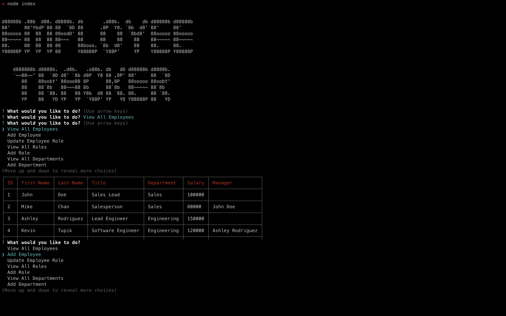

# Challenge 12

## Employee Tracker

This application tracks employees, their roles and which department they work in. It connects with the database and use postgres to get, put and update fields.

## Link

https://drive.google.com/file/d/1tO4HogpPq00Ar0ugz3v9e7IyEqdYrKpA/view?usp=sharing

## Screenshots

### Preview of Application (takes to video as well)

